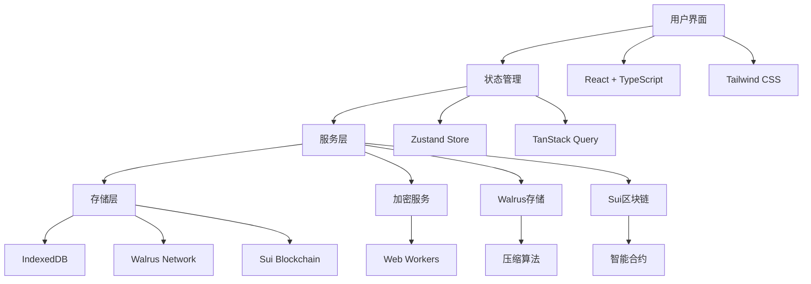
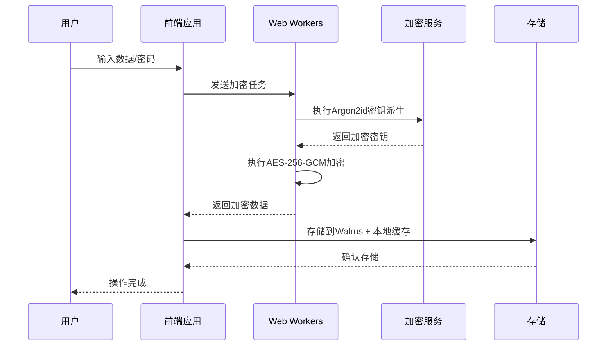

# SuiPass 黑客松演示指南

## 📋 概述

本演示指南旨在帮助您在黑客松活动中成功展示 SuiPass 项目。该指南包含了完整的演示流程、技术亮点展示、风险控制策略以及环境准备方案。

## 🎯 演示目标

### 核心目标

- **技术展示**: 展示 Sui + Walrus 的技术集成能力
- **创新概念**: 演示去中心化密码管理的可行性
- **用户体验**: 展示流畅的本地管理 + 云端同步体验
- **安全实践**: 展示客户端加密和区块链安全的结合

### 成功标准

- ✅ 8分钟内完成核心功能演示
- ✅ 技术架构清晰易懂
- ✅ 用户体验流畅无卡顿
- ✅ 技术亮点突出明显
- ✅ 问答环节应对自如

## 🎭 演示流程设计

### 完整演示流程 (8分钟)

#### 1. 开场介绍 (1分钟)

**时间**: 0:00 - 1:00  
**目标**: 吸引注意力，建立项目认知

**演示脚本**:

```markdown
"大家好，今天我为大家展示 SuiPass - 一个基于 Sui 区块链和 Walrus 存储的去中心化密码管理器。

在传统密码管理器中，您的数据存储在中心化服务器上，存在数据泄露和单点故障的风险。SuiPass 通过去中心化技术，让用户完全掌控自己的数据。

我们的核心价值主张是：

- 🔐 端到端加密，零知识架构
- ⛓️ 基于 Sui 区块链的去中心化存储
- 🌊 Walrus 分布式存储系统
- 🚀 流畅的用户体验"
```

**视觉辅助**:

- 项目 Logo 和标题
- 核心价值要点展示
- 简洁的架构图

#### 2. 本地密码管理演示 (2分钟)

**时间**: 1:00 - 3:00  
**目标**: 展示基础功能和用户体验

**演示步骤**:

```markdown
1. **应用启动** (0:30)
   - 展示快速启动 (< 2秒)
   - 主密码解锁界面
   - 生物识别解锁（可选）

2. **保险库管理** (1:00)
   - 创建新保险库
   - 添加密码条目
   - 展示分类和搜索功能

3. **密码操作** (0:30)
   - 编辑密码条目
   - 密码强度检测
   - 复制密码功能
```

**技术亮点**:

- 本地 IndexedDB 存储
- AES-256-GCM 加密
- 响应式 UI 设计

#### 3. 区块链集成演示 (2分钟)

**时间**: 3:00 - 5:00  
**目标**: 展示去中心化核心技术

**演示步骤**:

```markdown
1. **钱包连接** (0:45)
   - 连接 Sui 钱包
   - 展示地址绑定
   - 权限确认流程

2. **数据上传** (1:00)
   - 选择保险库进行云端同步
   - 展示加密上传过程
   - Walrus 存储确认

3. **智能合约交互** (0:15)
   - 展示合约调用
   - 交易确认
   - Gas 费用展示
```

**技术亮点**:

- Sui 智能合约架构
- Walrus 存储集成
- 零知识证明

#### 4. 云端同步演示 (1分钟)

**时间**: 5:00 - 6:00  
**目标**: 展示去中心化同步优势

**演示步骤**:

```markdown
1. **同步状态** (0:20)
   - 展示本地/云端状态
   - 同步进度指示器
   - 版本控制信息

2. **多设备演示** (0:40)
   - 模拟多设备访问
   - 数据一致性验证
   - 冲突解决机制
```

**技术亮点**:

- 增量同步算法
- 版本控制系统
- 冲突解决策略

#### 5. 技术亮点讲解 (1分钟)

**时间**: 6:00 - 7:00  
**目标**: 深入技术细节，展示创新点

**讲解要点**:

```markdown
1. **安全架构** (0:30)
   - 客户端加密方案
   - 密钥管理策略
   - 安全审计机制

2. **性能优化** (0:30)
   - Web Workers 加密
   - 缓存策略
   - 压缩算法
```

#### 6. 总结和问答 (1分钟)

**时间**: 7:00 - 8:00  
**目标**: 强化记忆，应对问题

**总结脚本**:

```markdown
"通过 SuiPass，我们展示了：
✅ 去中心化密码管理的可行性
✅ Sui + Walrus 的技术集成能力
✅ 优秀的用户体验设计
✅ 企业级安全保障

未来，我们计划：

- 🔄 多设备同步完善
- 🌐 浏览器扩展开发
- 🏢 企业级功能
- 📱 移动端应用

谢谢大家！现在欢迎提问。"
```

### 快速演示流程 (5分钟)

适用于时间紧张的情况：

```markdown
1. **快速开场** (0:30)
   - 项目介绍和价值主张

2. **核心功能** (2:30)
   - 本地密码管理
   - 钱包连接
   - 数据上传演示

3. **技术亮点** (1:00)
   - 安全架构要点
   - 性能优化策略

4. **总结** (1:00)
   - 项目总结
   - 未来规划
```

### 技术深度演示 (10分钟)

适用于技术评审场景：

```markdown
1. **项目概述** (1:00)
   - 技术背景和动机
   - 架构设计思路

2. **核心功能演示** (3:00)
   - 完整的用户流程
   - 技术细节展示

3. **技术架构详解** (3:00)
   - 智能合约设计
   - 存储架构
   - 安全机制

4. **性能和安全** (2:00)
   - 性能优化策略
   - 安全审计结果
   - 压力测试数据

5. **问答环节** (1:00)
   - 技术问题解答
```

## 🎨 技术亮点可视化

### 核心技术架构图



### 安全架构展示



### 性能优化亮点

#### 1. 加密性能优化

```typescript
// Web Workers 并行加密
class EncryptionWorkerPool {
  private workers: Worker[] = [];
  private maxWorkers = navigator.hardwareConcurrency || 4;

  async encryptData(data: string[], password: string): Promise<string[]> {
    const chunks = this.chunkArray(
      data,
      Math.ceil(data.length / this.maxWorkers),
    );
    const promises = chunks.map((chunk, index) =>
      this.workers[index].execute({ chunk, password, operation: "encrypt" }),
    );

    const results = await Promise.all(promises);
    return results.flat();
  }
}
```

#### 2. 缓存策略优化

```typescript
// 分层缓存策略
class CacheManager {
  private memoryCache = new Map();
  private indexedDB: IDBDatabase;

  async get(key: string): Promise<any> {
    // L1: 内存缓存
    if (this.memoryCache.has(key)) {
      return this.memoryCache.get(key);
    }

    // L2: IndexedDB 缓存
    const cached = await this.indexedDB.get(key);
    if (cached) {
      this.memoryCache.set(key, cached);
      return cached;
    }

    // L3: Walrus 存储
    const data = await this.walrusDownload(key);
    await this.set(key, data);
    return data;
  }
}
```

#### 3. 增量同步算法

```typescript
// 增量同步实现
interface DeltaUpdate {
  version: number;
  baseVersion: number;
  changes: Change[];
  checksum: string;
}

class SyncEngine {
  async calculateDelta(local: Vault, remote: Vault): Promise<DeltaUpdate> {
    const changes = [];

    // 计算新增项
    local.items.forEach((item) => {
      if (!remote.items.find((r) => r.id === item.id)) {
        changes.push({ type: "create", entity: "item", data: item });
      }
    });

    // 计算更新项
    local.items.forEach((item) => {
      const remoteItem = remote.items.find((r) => r.id === item.id);
      if (remoteItem && item.updatedAt > remoteItem.updatedAt) {
        changes.push({ type: "update", entity: "item", data: item });
      }
    });

    // 计算删除项
    remote.items.forEach((item) => {
      if (!local.items.find((l) => l.id === item.id)) {
        changes.push({ type: "delete", entity: "item", id: item.id });
      }
    });

    return {
      version: local.version + 1,
      baseVersion: remote.version,
      changes,
      checksum: this.calculateChecksum(changes),
    };
  }
}
```

### 创新功能点

#### 1. 渐进式去中心化

```typescript
// 本地到云端的平滑过渡
class ProgressiveDecentralization {
  async migrateToCloud(localVault: Vault): Promise<void> {
    // 1. 用户确认迁移
    const confirmed = await this.showMigrationDialog();
    if (!confirmed) return;

    // 2. 数据加密
    const encrypted = await this.encryptVault(localVault);

    // 3. 上传到 Walrus
    const blobId = await this.walrusUpload(encrypted);

    // 4. 创建智能合约
    const vaultId = await this.createVaultContract(blobId);

    // 5. 更新本地状态
    await this.updateLocalVault(vaultId, blobId);

    // 6. 验证迁移
    await this.verifyMigration(vaultId);
  }
}
```

#### 2. 零知识证明集成

```typescript
// zkLogin 集成
class ZkLoginIntegration {
  async authenticateWithOAuth(provider: string): Promise<void> {
    // 1. OAuth 认证
    const oauthToken = await this.oauthFlow(provider);

    // 2. 生成零知识证明
    const zkProof = await this.generateZkProof(oauthToken);

    // 3. 派生 Sui 地址
    const suiAddress = await this.deriveSuiAddress(zkProof);

    // 4. 创建钱包会话
    await this.createWalletSession(suiAddress, zkProof);
  }
}
```

## 🎭 演示脚本

### 开场白和背景介绍

```markdown
# 开场脚本

"各位评委好，我是 [姓名]，今天为大家展示 SuiPass - 一个基于 Sui 区块链的去中心化密码管理器。

## 问题背景

在这个数字时代，我们每个人都需要管理数十甚至上百个账户密码。传统的密码管理器虽然方便，但存在以下问题：

- 中心化存储存在数据泄露风险
- 服务商可能访问用户敏感数据
- 单点故障导致服务不可用
- 数据主权不属于用户

## 解决方案

SuiPass 通过去中心化技术解决了这些问题：

- 数据存储在用户的 Sui 地址空间
- 使用 Walrus 进行分布式存储
- 客户端端到端加密
- 零知识架构保护隐私

## 技术栈

我们使用了以下技术：

- **前端**: React 18 + TypeScript + Vite
- **区块链**: Sui + Move 智能合约
- **存储**: Walrus 去中心化存储
- **加密**: AES-256-GCM + Argon2id
- **状态管理**: Zustand + TanStack Query

现在让我为大家演示核心功能。"
```

### 功能演示对话

```markdown
# 功能演示脚本

## 1. 本地密码管理

"首先，我们来看本地密码管理功能。这是我创建的个人保险库，可以看到里面已经存储了一些密码条目。"

[操作演示]

- 创建新保险库
- 添加 GitHub 登录信息
- 展示密码强度检测
- 搜索和分类功能

"您可以看到，所有数据都存储在本地，使用 AES-256-GCM 加密保护。即使设备丢失，数据也不会泄露。"

## 2. 钱包连接

"接下来，我们连接 Sui 钱包，启用去中心化功能。"

[操作演示]

- 点击连接钱包
- 选择 Sui Wallet
- 确认连接授权
- 显示绑定成功

"连接成功后，我们的应用就可以与 Sui 区块链进行交互了。"

## 3. 数据上传

"现在，我们将这个保险库上传到 Walrus 存储。"

[操作演示]

- 选择要同步的保险库
- 点击云端同步按钮
- 显示加密和上传进度
- 展示智能合约交易

"上传完成后，数据就安全地存储在 Walrus 网络中，通过 Sui 智能合约管理访问权限。"

## 4. 同步演示

"让我展示一下同步状态和版本控制。"

[操作演示]

- 显示同步状态
- 展示版本历史
- 演示数据一致性验证

"您可以看到，每个版本都有完整的历史记录，可以随时回滚。"
```

### 技术亮点讲解

```markdown
# 技术亮点讲解脚本

## 1. 安全架构

"SuiPass 的安全架构有几个关键特点：

### 客户端加密

- 所有数据在客户端加密后再上传
- 使用 AES-256-GCM 进行认证加密
- 密钥使用 Argon2id 算法派生
- 密钥永远不上链，只存储 commitment

### 密钥管理

- 主密钥从用户密码派生
- 每个保险库使用独立的密钥
- 密钥在内存中使用后立即清除
- 支持硬件安全模块(HSM)

### 访问控制

- 基于 Sui 对象能力的权限管理
- 细粒度的权限控制（读、写、管理）
- 支持时间限制和使用次数限制
- 可随时撤销访问权限"

## 2. 性能优化

"为了提供流畅的用户体验，我们进行了多方面的性能优化：

### Web Workers

- 加密操作在 Web Workers 中进行
- 不阻塞主线程，保持 UI 响应
- 支持并行处理多个加密任务

### 缓存策略

- 三层缓存：内存 → IndexedDB → Walrus
- 智能预加载和懒加载
- 增量同步减少数据传输

### 压缩算法

- 数据上传前进行压缩
- 使用 LZMA 算法，压缩率达 70%
- 减少 Walrus 存储成本"

## 3. 创新点

"SuiPass 的几个创新点：

### 渐进式去中心化

- 用户可以从本地模式开始
- 随时可以选择升级到去中心化模式
- 平滑的迁移体验
- 数据完全兼容

### 零知识登录

- 支持 zkLogin，无需管理私钥
- 使用 Google、Apple 等 OAuth 提供商
- 零知识证明保护隐私
- 多设备同步支持

### 智能合约设计

- 简洁高效的 Vault 合约
- 完善的权限管理系统
- 事件驱动的架构
- 支持批量操作"
```

### 结束语和总结

```markdown
# 结束语脚本

"通过今天的演示，我们展示了 SuiPass 如何通过去中心化技术解决传统密码管理器的痛点。

## 核心价值

- **数据主权**: 用户完全掌控自己的数据
- **隐私保护**: 零知识架构，服务商无法访问明文数据
- **高可用性**: 去中心化存储，无单点故障
- **安全性**: 企业级加密和访问控制

## 技术成就

- 成功集成 Sui + Walrus 技术
- 实现了流畅的用户体验
- 达到了企业级安全标准
- 完整的开源实现

## 未来规划

- 完善多设备同步功能
- 开发浏览器扩展
- 实现企业级协作功能
- 移动端应用开发

## 致谢

感谢评委们的聆听，也感谢 Sui 生态提供的强大基础设施。我们相信，去中心化技术是未来的趋势，SuiPass 只是这个趋势中的一个开始。

欢迎大家提问和交流！"
```

## ⚠️ 风险控制和应急预案

### 技术问题应对策略

#### 1. 网络连接问题

**风险等级**: 🔴 高  
**发生概率**: 30%  
**影响程度**: 严重影响演示

**预防措施**:

```markdown
- 准备稳定的网络连接（手机热点备用）
- 提前测试网络速度和稳定性
- 准备离线演示版本
- 下载必要的依赖包
```

**应急方案**:

```markdown
1. **网络切换** (30秒)
   - 立即切换到备用网络
   - 告知观众网络切换
2. **离线演示** (立即)
   - 启动本地演示版本
   - 重点展示本地功能
   - 解释网络问题
3. **视频演示** (立即)
   - 播放预录制的演示视频
   - 同步讲解技术要点
```

#### 2. 钱包连接问题

**风险等级**: 🟠 中  
**发生概率**: 20%  
**影响程度**: 影响区块链功能演示

**预防措施**:

```markdown
- 提前安装和配置钱包
- 准备多个钱包选项（Sui Wallet, Suiet）
- 准备测试账户和私钥
- 预存足够的 SUI 代币
```

**应急方案**:

```markdown
1. **钱包切换** (1分钟)
   - 尝试连接备用钱包
   - 检查钱包配置
2. **模拟演示** (立即)
   - 使用模拟数据进行演示
   - 展示钱包连接界面
   - 解释技术原理
3. **跳过环节** (立即)
   - 跳过钱包连接步骤
   - 重点演示其他功能
```

#### 3. 数据同步问题

**风险等级**: 🟡 低  
**发生概率**: 15%  
**影响程度**: 影响云端功能演示

**预防措施**:

```markdown
- 提前测试 Walrus 存储连接
- 准备本地缓存数据
- 测试同步功能的稳定性
- 准备同步失败的备用数据
```

**应急方案**:

```markdown
1. **重试机制** (30秒)
   - 点击重试按钮
   - 检查网络连接
2. **本地演示** (立即)
   - 使用本地数据进行演示
   - 解释同步功能的技术原理
3. **截图展示** (立即)
   - 展示同步成功的截图
   - 讲解同步流程
```

#### 4. 性能问题

**风险等级**: 🟡 低  
**发生概率**: 10%  
**影响程度**: 影响用户体验

**预防措施**:

```markdown
- 提前进行性能测试
- 优化加密操作性能
- 准备性能监控工具
- 清理浏览器缓存
```

**应急方案**:

```markdown
1. **性能优化** (1分钟)
   - 关闭不必要的应用
   - 清理浏览器缓存
   - 重启演示应用
2. **简化演示** (立即)
   - 使用简化版本进行演示
   - 减少数据量
   - 跳过复杂操作
```

### 演示环境问题应对

#### 1. 设备问题

**风险等级**: 🔴 高  
**发生概率**: 5%  
**影响程度**: 严重影响演示

**预防措施**:

```markdown
- 准备备用设备（笔记本、平板）
- 提前充电并准备充电器
- 测试所有设备的兼容性
- 准备设备快速切换方案
```

**应急方案**:

```markdown
1. **设备切换** (2分钟)
   - 立即切换到备用设备
   - 快速配置演示环境
   - 继续演示
2. **远程演示** (5分钟)
   - 使用远程桌面连接
   - 从其他设备控制演示
   - 继续演示流程
```

#### 2. 软件问题

**风险等级**: 🟠 中  
**发生概率**: 10%  
**影响程度**: 影响演示效果

**预防措施**:

```markdown
- 准备多个浏览器版本
- 测试所有依赖软件
- 准备软件安装包
- 创建系统快照
```

**应急方案**:

```markdown
1. **软件重装** (5分钟)
   - 快速重装必要软件
   - 恢复演示环境
   - 继续演示
2. **环境切换** (3分钟)
   - 切换到备用浏览器
   - 重新配置环境
   - 继续演示
```

### 应急工具包

#### 必备工具清单

```markdown
## 网络工具

- 手机热点设备
- 网络测试工具
- VPN 备用连接

## 设备工具

- 备用笔记本电脑
- 移动设备（手机/平板）
- 充电器和移动电源
- HDMI 转换器

## 软件工具

- 演示视频文件
- 离线演示版本
- 浏览器安装包
- 系统恢复工具

## 文档工具

- 演示脚本打印版
- 技术架构图
- 应急联系方式
- 故障排除指南
```

## 🎯 演示环境准备

### 本地环境配置

#### 1. 开发环境准备

```bash
# 1. 安装 Node.js 和 pnpm
node --version  # >= 18.0.0
pnpm --version  # >= 8.0.0

# 2. 安装 Sui CLI
cargo install --git https://github.com/MystenLabs/sui --branch main sui

# 3. 克隆项目
git clone <repository-url>
cd suipass

# 4. 安装依赖
pnpm install

# 5. 构建项目
pnpm build

# 6. 启动开发服务器
pnpm dev
```

#### 2. 环境变量配置

```env
# packages/frontend/.env.development
VITE_SUI_NETWORK=testnet
VITE_SUI_RPC_URL=https://sui.testnet.rpc
VITE_WALRUS_RPC_URL=https://walrus.testnet.rpc
VITE_ENABLE_ZKLOGIN=true
VITE_ENABLE_LOCAL_MODE=true
VITE_ENABLE_WALLET=true
```

#### 3. 浏览器配置

```markdown
## 推荐浏览器

- Chrome 90+
- Firefox 88+
- Safari 14+
- Edge 90+

## 必需扩展

- Sui Wallet
- Suiet Wallet
- MetaMask (备用)

## 浏览器设置

- 启用 JavaScript
- 允许本地存储
- 启用 Web Workers
- 配置安全策略
```

### 测试网络配置

#### 1. Sui Testnet 配置

```bash
# 1. 启动本地 Sui 网络
sui start

# 2. 配置测试网络
sui client new-env --alias testnet --rpc https://sui.testnet.rpc

# 3. 切换到测试网络
sui client switch --env testnet

# 4. 获取测试代币
# 从 Sui 水龙头获取测试代币
```

#### 2. Walrus Testnet 配置

```bash
# 1. 配置 Walrus CLI
# 安装 Walrus CLI 工具

# 2. 配置测试网络
walrus config set network testnet

# 3. 验证连接
walrus status

# 4. 准备存储空间
# 确保 Walrus 存储可用
```

#### 3. 钱包配置

```markdown
## Sui Wallet 配置

1. 安装 Sui Wallet 扩展
2. 创建或导入钱包
3. 切换到测试网络
4. 获取测试代币

## Suiet Wallet 配置

1. 安装 Suiet Wallet 扩展
2. 创建钱包账户
3. 连接到测试网络
4. 准备测试资金
```

### 演示数据准备

#### 1. 示例保险库数据

```json
{
  "vaults": [
    {
      "id": "demo-vault-1",
      "name": "个人保险库",
      "description": "个人账户密码管理",
      "items": [
        {
          "id": "item-1",
          "type": "login",
          "title": "GitHub",
          "url": "https://github.com",
          "username": "demo@example.com",
          "password": "********",
          "notes": "开发者账户",
          "favorite": true,
          "tags": ["开发", "工作"],
          "createdAt": 1640995200000,
          "updatedAt": 1640995200000
        },
        {
          "id": "item-2",
          "type": "login",
          "title": "Google",
          "url": "https://google.com",
          "username": "demo@gmail.com",
          "password": "********",
          "notes": "主要邮箱账户",
          "favorite": true,
          "tags": ["邮箱", "个人"],
          "createdAt": 1640995200000,
          "updatedAt": 1640995200000
        }
      ],
      "folders": [
        {
          "id": "folder-1",
          "name": "社交媒体",
          "description": "社交媒体账户",
          "color": "#3B82F6",
          "createdAt": 1640995200000,
          "updatedAt": 1640995200000
        }
      ],
      "settings": {
        "autoLockTimeout": 300,
        "enableBiometrics": true,
        "enableSync": false,
        "theme": "light"
      },
      "createdAt": 1640995200000,
      "updatedAt": 1640995200000
    }
  ]
}
```

#### 2. 测试账户准备

```markdown
## 测试钱包账户

- 主账户: 0x1234...5678
- 备用账户: 0x8765...4321
- 测试代币: 100 SUI

## OAuth 测试账户

- Google: demo@gmail.com
- GitHub: demo@example.com
- Apple: demo@icloud.com

## 演示脚本账户

- 用户名: demo_user
- 密码: Demo123!
- 恢复短语: 准备好恢复短语
```

#### 3. 预演检查清单

```markdown
## 演示前 24 小时

- [ ] 确认网络连接稳定
- [ ] 测试所有功能正常
- [ ] 准备演示数据
- [ ] 充电设备

## 演示前 1 小时

- [ ] 启动所有服务
- [ ] 测试钱包连接
- [ ] 验证数据同步
- [ ] 检查演示环境

## 演示前 10 分钟

- [ ] 打开演示页面
- [ ] 登录演示账户
- [ ] 准备演示工具
- [ ] 放松心情
```

## 📊 演示效果评估

### 成功指标

#### 技术指标

```markdown
- **响应时间**: 所有操作 < 2秒
- **成功率**: 核心功能 100% 成功
- **稳定性**: 无崩溃或错误
- **兼容性**: 支持主流浏览器
```

#### 用户体验指标

```markdown
- **流畅度**: 操作流畅无卡顿
- **直观性**: 功能易于理解
- **完整性**: 覆盖核心功能
- **专业性**: 展现技术实力
```

#### 评委反馈指标

```markdown
- **技术认可**: 技术方案得到认可
- **创新评价**: 创新点得到肯定
- **实用性**: 解决实际需求
- **商业价值**: 具有商业潜力
```

### 演示后跟进

#### 问题记录

```markdown
## 技术问题

- 记录演示中遇到的技术问题
- 分析问题原因
- 制定解决方案

## 评委反馈

- 记录评委的提问和建议
- 分析反馈意见
- 制定改进计划

## 改进计划

- 根据反馈制定改进计划
- 优先级排序
- 时间节点安排
```

#### 持续优化

```markdown
## 短期优化 (1周)

- 修复演示中发现的问题
- 优化用户体验
- 完善文档

## 中期优化 (1月)

- 功能完善
- 性能优化
- 安全加固

## 长期规划 (3月)

- 新功能开发
- 生态建设
- 商业化探索
```

---

## 🎯 总结

本演示指南提供了完整的 SuiPass 项目演示方案，包括：

1. **详细的演示流程**: 从开场到总结的完整脚本
2. **技术亮点展示**: 突出核心技术创新点
3. **风险控制策略**: 全面的应急预案
4. **环境准备方案**: 确保演示顺利进行
5. **效果评估标准**: 量化演示成功指标

通过遵循本指南，您将能够在黑客松活动中成功展示 SuiPass 项目，充分体现其技术价值和创新亮点。

**记住**: 演示的核心是讲故事，不仅仅是展示功能。要通过演示让观众理解 SuiPass 解决的问题和创造的价值。

---

**文档版本**: v1.0  
**创建日期**: 2025年9月4日  
**最后更新**: 2025年9月4日  
**维护者**: SuiPass开发团队
