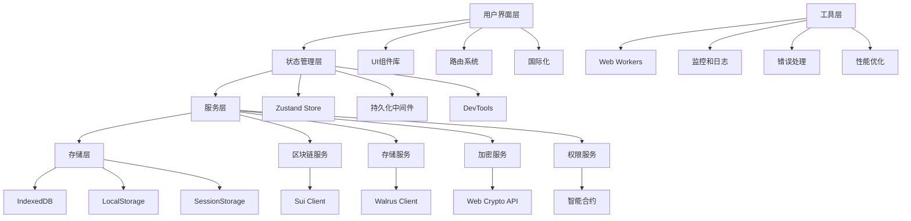
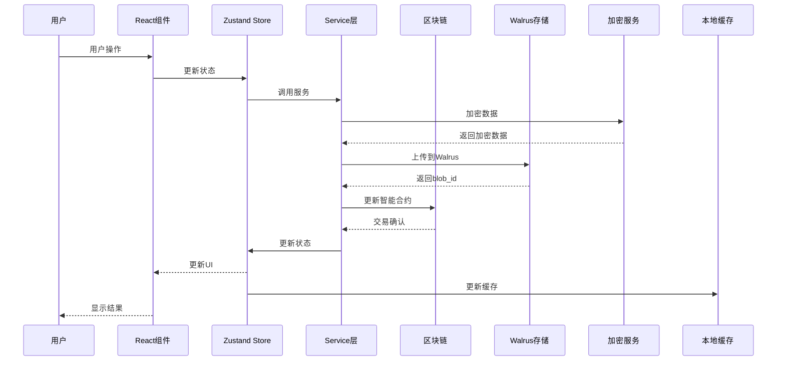
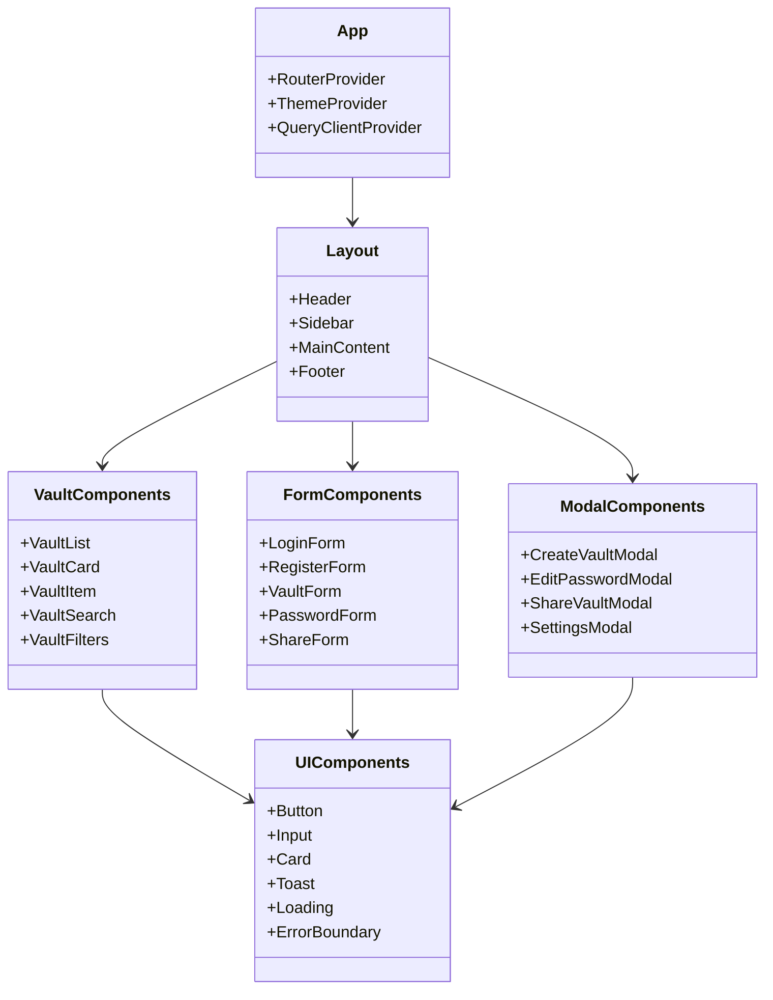
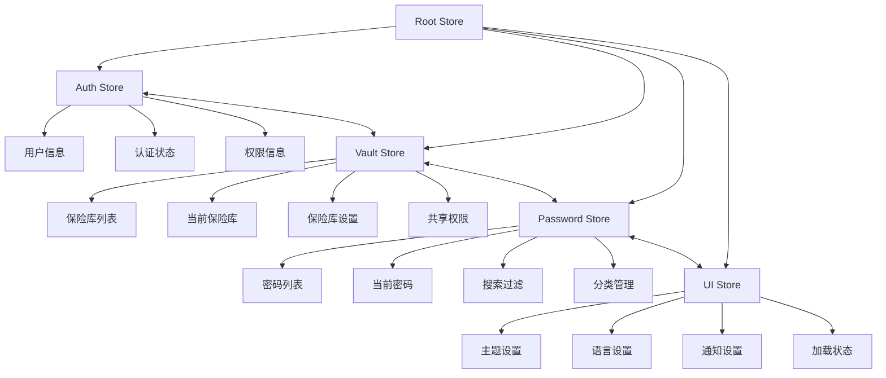
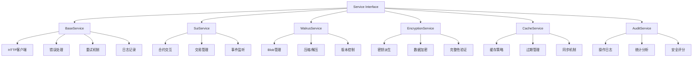
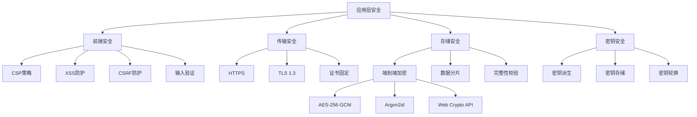
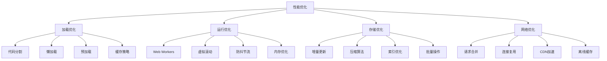
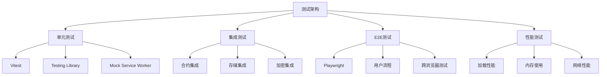
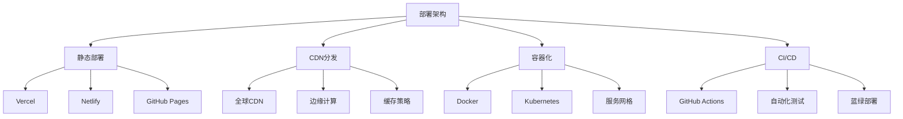
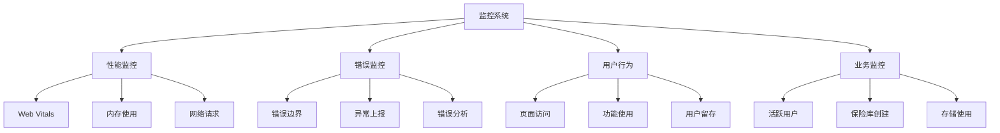

# SuiPass 前端架构设计文档

## 📋 项目概述

基于 SuiPass 智能合约数据结构和 Walrus 存储集成设计，本文档详细阐述了前端系统的整体架构设计。该架构采用 React 18 + TypeScript + Vite 技术栈，实现了去中心化密码管理系统的完整前端解决方案。

### 🎯 设计目标

- **安全优先**: 端到端加密，零知识架构
- **性能卓越**: 多层缓存，增量更新，Web Workers 优化
- **用户体验**: 响应式设计，离线支持，实时同步
- **可扩展性**: 模块化架构，插件化设计
- **开发效率**: TypeScript 全覆盖，完善的工具链

## 🏗️ 整体架构

### 系统架构图



### 数据流架构



## 📁 目录结构

```
packages/frontend/src/
├── components/           # 可复用组件
│   ├── ui/              # 基础UI组件
│   ├── forms/           # 表单组件
│   ├── vault/           # 保险库组件
│   ├── auth/            # 认证组件
│   └── layout/          # 布局组件
├── pages/               # 页面组件
│   ├── Dashboard.tsx   # 仪表板
│   ├── Vault.tsx       # 保险库管理
│   ├── Auth.tsx        # 认证页面
│   └── Settings.tsx    # 设置页面
├── stores/              # 状态管理
│   ├── auth.ts          # 认证状态
│   ├── vault.ts         # 保险库状态
│   ├── password.ts      # 密码状态
│   └── ui.ts            # UI状态
├── services/            # 服务层
│   ├── sui.ts           # Sui区块链服务
│   ├── walrus.ts        # Walrus存储服务
│   ├── encryption.ts    # 加密服务
│   ├── cache.ts         # 缓存服务
│   └── audit.ts         # 审计服务
├── hooks/               # 自定义Hooks
│   ├── useAuth.ts       # 认证Hook
│   ├── useVault.ts      # 保险库Hook
│   ├── usePassword.ts   # 密码Hook
│   └── useEncryption.ts # 加密Hook
├── utils/               # 工具函数
│   ├── crypto.ts        # 加密工具
│   ├── validation.ts    # 验证工具
│   ├── storage.ts       # 存储工具
│   └── helpers.ts       # 辅助函数
├── types/               # TypeScript类型定义
│   ├── vault.ts         # 保险库类型
│   ├── password.ts      # 密码类型
│   ├── sui.ts           # Sui相关类型
│   └── api.ts           # API类型
├── workers/             # Web Workers
│   ├── encryption.worker.ts
│   └── compression.worker.ts
├── constants/           # 常量定义
│   ├── routes.ts        # 路由常量
│   ├── storage.ts       # 存储常量
│   └── encryption.ts    # 加密常量
├── styles/              # 样式文件
│   ├── globals.css      # 全局样式
│   └── themes/          # 主题样式
└── i18n/                # 国际化
    ├── locales/         # 语言文件
    └── config.ts        # 国际化配置
```

## 🎨 UI组件架构

### 组件层次结构



## 🗃️ 状态管理架构

### Zustand Store结构



### Store实现示例

```typescript
// stores/vault.ts
import { create } from "zustand";
import { persist, createJSONStorage } from "zustand/middleware";
import { VaultService } from "@/services/vault";
import type { Vault, VaultSettings } from "@/types/vault";

interface VaultState {
  // 状态
  vaults: Vault[];
  currentVault: Vault | null;
  isLoading: boolean;
  error: string | null;

  // 操作
  createVault: (name: string, settings: VaultSettings) => Promise<void>;
  updateVault: (vaultId: string, updates: Partial<Vault>) => Promise<void>;
  deleteVault: (vaultId: string) => Promise<void>;
  setCurrentVault: (vault: Vault | null) => void;
  refreshVaults: () => Promise<void>;

  // 分享和权限
  shareVault: (
    vaultId: string,
    address: string,
    permissions: number,
  ) => Promise<void>;
  revokeAccess: (vaultId: string, address: string) => Promise<void>;
}

export const useVaultStore = create<VaultState>()(
  persist(
    (set, get) => ({
      vaults: [],
      currentVault: null,
      isLoading: false,
      error: null,

      createVault: async (name: string, settings: VaultSettings) => {
        set({ isLoading: true, error: null });
        try {
          const vault = await VaultService.createVault(name, settings);
          set((state) => ({
            vaults: [...state.vaults, vault],
            currentVault: vault,
            isLoading: false,
          }));
        } catch (error) {
          set({ error: error.message, isLoading: false });
          throw error;
        }
      },

      updateVault: async (vaultId: string, updates: Partial<Vault>) => {
        set({ isLoading: true, error: null });
        try {
          const updatedVault = await VaultService.updateVault(vaultId, updates);
          set((state) => ({
            vaults: state.vaults.map((v) =>
              v.id === vaultId ? updatedVault : v,
            ),
            currentVault:
              state.currentVault?.id === vaultId
                ? updatedVault
                : state.currentVault,
            isLoading: false,
          }));
        } catch (error) {
          set({ error: error.message, isLoading: false });
          throw error;
        }
      },

      // ... 其他方法
    }),
    {
      name: "vault-storage",
      storage: createJSONStorage(() => localStorage),
      partialize: (state) => ({
        vaults: state.vaults,
        currentVault: state.currentVault,
      }),
    },
  ),
);
```

## 🔧 服务层架构

### 服务层设计



### 核心服务实现

```typescript
// services/walrus.ts
import { WalrusClient } from "@mysten/walrus";
import { EncryptionService } from "./encryption";
import { CacheService } from "./cache";
import type { VaultBlob, DeltaUpdate } from "@/types/walrus";

export class WalrusStorageService {
  private client: WalrusClient;
  private encryption: EncryptionService;
  private cache: CacheService;
  private retryAttempts = 3;
  private maxBlobSize = 10 * 1024 * 1024; // 10MB

  constructor() {
    this.client = new WalrusClient({
      network: process.env.VITE_WALRUS_NETWORK || "testnet",
      url: process.env.VITE_WALRUS_RPC_URL,
    });
    this.encryption = new EncryptionService();
    this.cache = new CacheService();
  }

  /**
   * 上传保险库数据到Walrus
   */
  async uploadVault(vault: VaultBlob): Promise<string> {
    try {
      // 1. 验证数据完整性
      this.validateVault(vault);

      // 2. 压缩数据
      const compressed = await this.compressVault(vault);

      // 3. 加密数据
      const encrypted = await this.encryption.encrypt(compressed);

      // 4. 上传到Walrus
      const blobId = await this.uploadWithRetry(encrypted);

      // 5. 更新缓存
      await this.cache.setVault(blobId, vault);

      return blobId;
    } catch (error) {
      console.error("Failed to upload vault:", error);
      throw new Error("Vault upload failed");
    }
  }

  /**
   * 从Walrus下载保险库数据
   */
  async downloadVault(blobId: string): Promise<VaultBlob> {
    try {
      // 1. 检查缓存
      const cached = await this.cache.getVault(blobId);
      if (cached) {
        return cached;
      }

      // 2. 从Walrus下载
      const encrypted = await this.downloadWithRetry(blobId);

      // 3. 解密数据
      const decrypted = await this.encryption.decrypt(encrypted);

      // 4. 解压数据
      const vault = await this.decompressVault(decrypted);

      // 5. 验证数据完整性
      this.validateVault(vault);

      // 6. 更新缓存
      await this.cache.setVault(blobId, vault);

      return vault;
    } catch (error) {
      console.error("Failed to download vault:", error);
      throw new Error("Vault download failed");
    }
  }

  /**
   * 创建增量更新
   */
  async createDeltaUpdate(
    currentVault: VaultBlob,
    previousVault: VaultBlob,
  ): Promise<DeltaUpdate> {
    const changes = this.calculateChanges(currentVault, previousVault);
    const delta: DeltaUpdate = {
      version: currentVault.version,
      base_version: previousVault.version,
      changes,
      checksum: await this.generateChecksum(changes),
    };

    return delta;
  }

  // ... 其他辅助方法
}
```

## 🔐 安全架构

### 安全层次结构



### 加密服务实现

```typescript
// services/encryption.ts
import * as argon2 from "argon2-browser";

export class EncryptionService {
  private algorithm = "AES-256-GCM";
  private keyDerivationAlgorithm = "Argon2id";
  private keyLength = 256; // bits
  private ivLength = 12; // bytes for GCM

  /**
   * 加密数据
   */
  async encrypt(
    data: Uint8Array,
    masterPassword: string,
  ): Promise<EncryptedData> {
    try {
      // 1. 生成加密密钥
      const key = await this.deriveKey(masterPassword);

      // 2. 生成IV
      const iv = crypto.getRandomValues(new Uint8Array(this.ivLength));

      // 3. 加密数据
      const encryptedData = await crypto.subtle.encrypt(
        {
          name: "AES-GCM",
          iv,
        },
        key,
        data,
      );

      // 4. 提取认证标签
      const encryptedArray = new Uint8Array(encryptedData);
      const tag = encryptedArray.slice(-16); // GCM tag is 16 bytes
      const ciphertext = encryptedArray.slice(0, -16);

      return {
        algorithm: this.algorithm,
        ciphertext: Array.from(ciphertext),
        iv: Array.from(iv),
        tag: Array.from(tag),
        keyId: await this.getKeyId(key),
      };
    } catch (error) {
      console.error("Encryption failed:", error);
      throw new Error("Failed to encrypt data");
    }
  }

  /**
   * 派生密钥
   */
  private async deriveKey(masterPassword: string): Promise<CryptoKey> {
    try {
      // 使用 Argon2id 进行密钥派生
      const salt = crypto.getRandomValues(new Uint8Array(16));
      const derivedKey = await argon2.hash({
        pass: masterPassword,
        salt: Array.from(salt),
        type: argon2.ArgonType.Argon2id,
        mem: 65536, // 64MB
        time: 3, // 3 iterations
        hashLen: this.keyLength / 8,
      });

      // 导入为 CryptoKey
      return crypto.subtle.importKey(
        "raw",
        new Uint8Array(derivedKey.hash),
        { name: "AES-GCM" },
        false,
        ["encrypt", "decrypt"],
      );
    } catch (error) {
      console.error("Key derivation failed:", error);
      throw new Error("Failed to derive encryption key");
    }
  }

  // ... 其他方法
}
```

## ⚡ 性能优化架构

### 性能优化策略



### Web Worker实现

```typescript
// workers/encryption.worker.ts
import * as argon2 from "argon2-browser";

// 加密Worker
self.onmessage = async (event: MessageEvent) => {
  const { type, data, password } = event.data;

  try {
    switch (type) {
      case "encrypt":
        const encrypted = await encryptData(data, password);
        self.postMessage({ type: "encrypted", data: encrypted });
        break;

      case "decrypt":
        const decrypted = await decryptData(data, password);
        self.postMessage({ type: "decrypted", data: decrypted });
        break;

      case "deriveKey":
        const key = await deriveKey(password);
        self.postMessage({ type: "keyDerived", data: key });
        break;
    }
  } catch (error) {
    self.postMessage({ type: "error", error: error.message });
  }
};

async function encryptData(
  data: Uint8Array,
  password: string,
): Promise<EncryptedData> {
  // 实现加密逻辑
  return {};
}

async function decryptData(
  encryptedData: EncryptedData,
  password: string,
): Promise<Uint8Array> {
  // 实现解密逻辑
  return new Uint8Array();
}

async function deriveKey(password: string): Promise<CryptoKey> {
  // 实现密钥派生逻辑
  return {} as CryptoKey;
}
```

## 🧪 测试架构

### 测试策略



### 测试配置示例

```typescript
// vitest.config.ts
import { defineConfig } from "vitest/config";
import react from "@vitejs/plugin-react";
import path from "path";

export default defineConfig({
  plugins: [react()],
  test: {
    globals: true,
    environment: "jsdom",
    setupFiles: ["./src/test/setup.ts"],
  },
  resolve: {
    alias: {
      "@": path.resolve(__dirname, "./src"),
    },
  },
});

// src/test/setup.ts
import "@testing-library/jest-dom";
import { vi } from "vitest";

// Mock Web Crypto API
Object.defineProperty(global, "crypto", {
  value: {
    getRandomValues: vi.fn((arr) =>
      Array.from({ length: arr.length }, (_, i) => i),
    ),
    subtle: {
      encrypt: vi.fn(),
      decrypt: vi.fn(),
      generateKey: vi.fn(),
    },
  },
  configurable: true,
});

// Mock IndexedDB
vi.mock("idb", () => ({
  openDB: vi.fn(),
}));
```

## 🚀 部署架构

### 部署策略



### Docker配置

```dockerfile
# Dockerfile
FROM node:18-alpine AS base

# Install dependencies
FROM base AS deps
WORKDIR /app
COPY package.json pnpm-lock.yaml ./
RUN npm install -g pnpm && pnpm install --frozen-lockfile

# Build application
FROM base AS builder
WORKDIR /app
COPY --from=deps /app/node_modules ./node_modules
COPY . .
RUN pnpm build

# Production image
FROM base AS runner
WORKDIR /app
COPY --from=builder /app/dist ./dist
COPY --from=builder /app/public ./public

EXPOSE 3000
ENV PORT 3000
CMD ["npm", "run", "preview"]
```

## 📊 监控和分析

### 监控架构



## 🎯 总结

### 核心优势

1. **技术先进性**
   - 基于 React 18 + TypeScript 的现代前端架构
   - 完整的去中心化存储和加密方案
   - 模块化设计，便于维护和扩展

2. **性能优势**
   - Web Workers 优化加密性能
   - 多层缓存策略提升响应速度
   - 增量更新减少数据传输

3. **安全优势**
   - 端到端加密确保数据安全
   - 零知识架构保护用户隐私
   - 完整的审计和监控体系

4. **开发效率**
   - TypeScript 全覆盖类型安全
   - 完善的测试覆盖
   - 自动化部署流程

### 技术选型总结

| 层面     | 技术选型                     | 理由                 |
| -------- | ---------------------------- | -------------------- |
| 前端框架 | React 18                     | 生态完善，性能优秀   |
| 类型系统 | TypeScript                   | 类型安全，开发效率   |
| 构建工具 | Vite                         | 快速构建，开发体验好 |
| 状态管理 | Zustand                      | 轻量级，性能好       |
| 样式方案 | Tailwind CSS                 | 快速开发，一致性     |
| 测试框架 | Vitest + Playwright          | 快速测试，E2E覆盖    |
| 区块链   | Sui + @mysten/sui.js v0.54.1 | 官方支持，功能完整   |
| 存储     | Walrus v0.6.7 + IndexedDB    | 去中心化，离线支持   |
| 加密     | Web Crypto API               | 原生支持，安全性高   |

这个前端架构设计为 SuiPass 项目提供了完整的技术解决方案，既满足了黑客松的演示需求，又为未来的商业化发展奠定了坚实基础。

---

**文档版本**: v1.1  
**创建日期**: 2025年9月  
**最后更新**: 2025年9月4日  
**维护者**: SuiPass开发团队

### 🔄 依赖升级记录

- **2025年9月4日**: 升级 @mysten/sui.js 从 0.50.1 到 0.54.1
- **2025年9月4日**: 升级 @mysten/walrus 从 0.1.8 到 0.6.7
- **API变更**: WalrusClient 配置参数从 `rpcUrl` 改为 `url`
- **API变更**: 上传API参数从 `data` 改为 `blobBytes`
- **API变更**: 下载API返回从 `blob.data` 改为 `blob.blobBytes`
