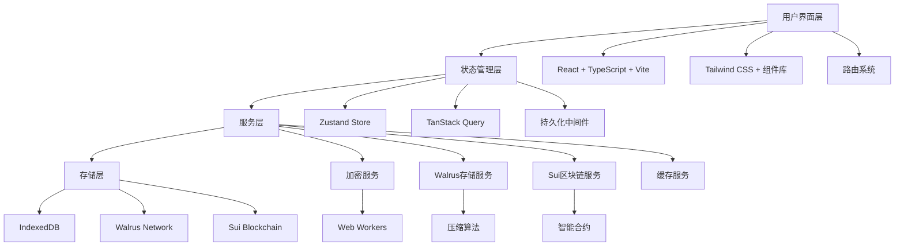
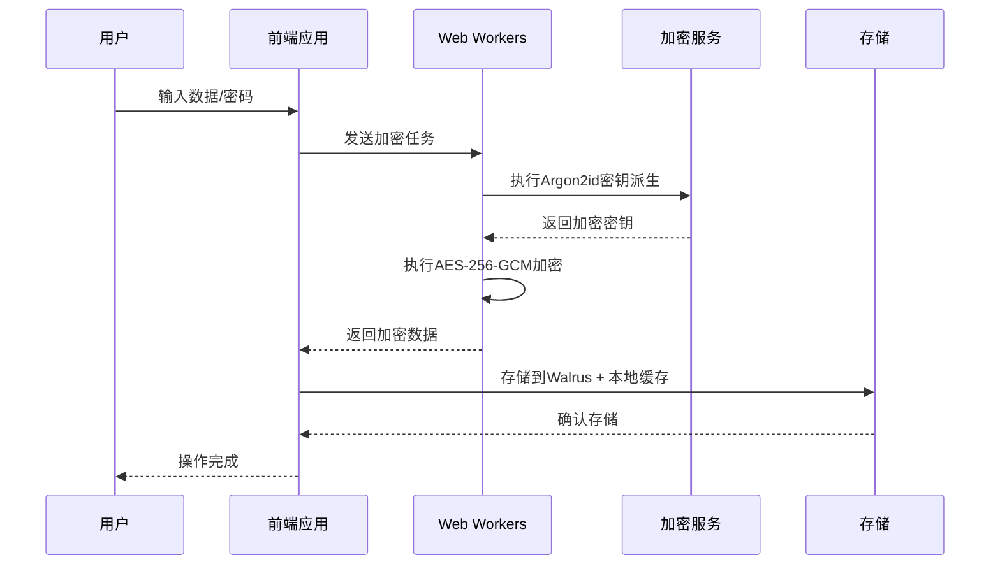

# SuiPass 黑客松开发指导文档

## 📋 项目概述

### 项目愿景

SuiPass 是一个基于 Sui 区块链和 Walrus 存储的去中心化密码管理器，旨在为黑客松展示 Sui 生态系统的技术创新能力。项目结合了客户端加密、区块链安全和去中心化存储，为用户提供安全、私密的密码管理解决方案。

### 核心价值主张

- **技术创新**：展示 Sui + Walrus 的技术集成能力
- **安全保证**：端到端加密，零知识架构
- **用户体验**：流畅的本地管理 + 云端同步
- **开源精神**：完全开源，推动去中心化技术发展

### 成功标准

- ✅ 完成核心功能演示
- ✅ 技术架构清晰可展示
- ✅ 用户体验流畅
- ✅ 代码质量可接受
- ✅ 文档完整

## 🏗️ 统一技术架构

### 整体系统架构



### 统一技术栈

| 层面         | 技术选型                        | 理由                 |
| ------------ | ------------------------------- | -------------------- |
| **前端框架** | React 18 + TypeScript           | 类型安全，生态完善   |
| **构建工具** | Vite                            | 快速构建，开发体验好 |
| **状态管理** | Zustand + TanStack Query        | 轻量级，性能优秀     |
| **样式方案** | Tailwind CSS                    | 快速开发，一致性     |
| **加密库**   | Web Crypto API + argon2-browser | 原生支持，安全性高   |
| **区块链**   | Sui + @mysten/sui.js            | 官方支持，功能完整   |
| **存储**     | Walrus + IndexedDB              | 去中心化，离线支持   |
| **测试**     | Vitest + Playwright             | 快速测试，E2E覆盖    |

## 🔐 统一安全架构

### 加密方案（已统一）

**采用方案**：`argon2-browser` + `AES-256-GCM` + Web Workers

**配置参数**：

```typescript
const ENCRYPTION_CONFIG = {
  algorithm: "AES-256-GCM",
  keyDerivation: "Argon2id",
  keyLength: 256, // bits
  ivLength: 12, // bytes
  tagLength: 16, // bytes
  saltLength: 16, // bytes
  iterations: 3,
  memory: 65536, // 64MB
  parallelism: 1,
};
```

**安全流程**：



### 密钥管理策略

```typescript
class KeyManager {
  private masterKey: CryptoKey | null = null;
  private keyCache = new Map<string, CryptoKey>();

  async initialize(masterPassword: string): Promise<void> {
    this.masterKey = await this.deriveMasterKey(masterPassword);
  }

  async deriveVaultKey(vaultId: string): Promise<CryptoKey> {
    // 使用HKDF从主密钥派生保险库特定密钥
    // 确保不同保险库使用不同密钥
  }

  async clearSensitiveData(): Promise<void> {
    // 及时清理内存中的敏感数据
  }
}
```

## 📊 智能合约数据结构

### 核心合约模块

#### 1. Vault 核心结构

```move
module suipass::vault_core {
    use sui::object::{UID, Self};
    use sui::tx_context::{Self, TxContext};
    use sui::clock::{Self, Clock};

    public struct Vault has key {
        id: UID,
        owner: address,
        name: String,
        walrus_blob_id: String,
        previous_blob_id: String,
        version: u64,
        created_at: u64,
        updated_at: u64,
        settings: VaultSettings,
    }

    public struct VaultSettings has store, drop {
        auto_lock_timeout: u64,
        max_items: u64,
        enable_sharing: bool,
        require_2fa: bool,
        backup_enabled: bool,
    }

    public fun create_vault(
        name: String,
        walrus_blob_id: String,
        settings: VaultSettings,
        clock: &Clock,
        ctx: &mut TxContext
    ): Vault {
        let timestamp = clock::timestamp_ms(clock) / 1000;
        let vault = Vault {
            id: object::new(ctx),
            owner: tx_context::sender(ctx),
            name,
            walrus_blob_id,
            previous_blob_id: String::empty(),
            version: 1,
            created_at: timestamp,
            updated_at: timestamp,
            settings,
        };

        transfer::transfer(vault, tx_context::sender(ctx));
        vault
    }
}
```

#### 2. 权限管理系统

```move
module suipass::permission_manager {
    use sui::object::{UID, Self};
    use sui::tx_context::{Self, TxContext};

    const PERMISSION_VIEW: u64 = 1;
    const PERMISSION_EDIT: u64 = 2;
    const PERMISSION_SHARE: u64 = 4;
    const PERMISSION_DELETE: u64 = 8;
    const PERMISSION_ADMIN: u64 = 16;

    public struct PermissionCapability has key {
        id: UID,
        vault_id: ID,
        granted_to: address,
        granted_by: address,
        permissions: u64,
        expires_at: u64,
        usage_count: u64,
        max_usage: u64,
        conditions: vector<String>,
        created_at: u64,
        is_active: bool,
    }
}
```

#### 3. 存储管理合约

```move
module suipass::storage_manager {
    use sui::object::{UID, Self};
    use sui::tx_context::{Self, TxContext};

    public struct StorageReference has key {
        id: UID,
        vault_id: ID,
        blob_id: String,
        blob_hash: String,
        blob_size: u64,
        encryption_info: EncryptionInfo,
        storage_cost: u64,
        uploaded_at: u64,
        expires_at: u64,
        is_compressed: bool,
        compression_ratio: u64,
    }

    public fun create_storage_reference(
        vault_id: ID,
        blob_id: String,
        blob_hash: String,
        blob_size: u64,
        encryption_info: EncryptionInfo,
        storage_cost: u64,
        expires_at: u64,
        is_compressed: bool,
        compression_ratio: u64,
        clock: &Clock,
        ctx: &mut TxContext
    ): StorageReference {
        let timestamp = clock::timestamp_ms(clock) / 1000;

        StorageReference {
            id: object::new(ctx),
            vault_id,
            blob_id,
            blob_hash,
            blob_size,
            encryption_info,
            storage_cost,
            uploaded_at: timestamp,
            expires_at,
            is_compressed,
            compression_ratio,
        }
    }
}
```

## 🌐 Walrus 存储集成

### 数据结构设计

```typescript
interface VaultBlob {
  metadata: VaultMetadata;
  folders: Folder[];
  passwords: PasswordItem[];
  settings: VaultSettings;
  version: number;
  checksum: string;
  compression: CompressionInfo;
}

interface VaultMetadata {
  id: string;
  name: string;
  description?: string;
  created_at: number;
  updated_at: number;
  total_items: number;
  total_size: number;
  encryption: EncryptionInfo;
}

interface EncryptionInfo {
  algorithm: "AES-256-GCM";
  key_id: string;
  iv: string;
  version: number;
  key_derivation: {
    algorithm: "Argon2id";
    iterations: number;
    memory: number;
    parallelism: number;
    salt: string;
  };
}
```

### Walrus 存储服务

```typescript
export class WalrusStorageService {
  private client: WalrusClient;
  private encryption: EncryptionService;
  private cache: CacheService;
  private retryAttempts = 3;
  private maxBlobSize = 10 * 1024 * 1024; // 10MB

  async uploadVault(vault: VaultBlob): Promise<string> {
    try {
      // 1. 验证数据完整性
      this.validateVault(vault);

      // 2. 压缩数据
      const compressed = await this.compressVault(vault);

      // 3. 加密数据
      const encrypted = await this.encryption.encrypt(compressed);

      // 4. 上传到 Walrus
      const blobId = await this.uploadWithRetry(encrypted);

      // 5. 更新缓存
      await this.cache.setVault(blobId, vault);

      return blobId;
    } catch (error) {
      console.error("Failed to upload vault:", error);
      throw new Error("Vault upload failed");
    }
  }

  async downloadVault(blobId: string): Promise<VaultBlob> {
    try {
      // 1. 检查缓存
      const cached = await this.cache.getVault(blobId);
      if (cached) {
        return cached;
      }

      // 2. 从 Walrus 下载
      const encrypted = await this.downloadWithRetry(blobId);

      // 3. 解密数据
      const decrypted = await this.encryption.decrypt(encrypted);

      // 4. 解压数据
      const vault = await this.decompressVault(decrypted);

      // 5. 验证数据完整性
      this.validateVault(vault);

      // 6. 更新缓存
      await this.cache.setVault(blobId, vault);

      return vault;
    } catch (error) {
      console.error("Failed to download vault:", error);
      throw new Error("Vault download failed");
    }
  }
}
```

### 性能优化策略

#### 1. 增量更新

```typescript
interface DeltaUpdate {
  version: number;
  base_version: number;
  changes: Change[];
  checksum: string;
}

interface Change {
  type: "create" | "update" | "delete";
  entity: "password" | "folder";
  id: string;
  data?: any;
  timestamp: number;
}
```

#### 2. 批量操作

```typescript
class BatchOperationService {
  private maxBatchSize = 10;
  private maxConcurrentBatches = 3;

  async batchUpload(vaults: VaultBlob[]): Promise<string[]> {
    const batches = this.createBatches(vaults);

    // 并行处理批次
    const batchPromises = batches
      .slice(0, this.maxConcurrentBatches)
      .map((batch) => this.processBatch(batch));

    const batchResults = await Promise.all(batchPromises);
    return batchResults.flat();
  }
}
```

## 🎨 前端架构设计

### 目录结构

```
packages/frontend/src/
├── components/           # 可复用组件
│   ├── ui/              # 基础UI组件
│   ├── forms/           # 表单组件
│   ├── vault/           # 保险库组件
│   ├── auth/            # 认证组件
│   └── layout/          # 布局组件
├── pages/               # 页面组件
│   ├── Dashboard.tsx    # 仪表板
│   ├── Vault.tsx        # 保险库管理
│   ├── Auth.tsx         # 认证页面
│   └── Settings.tsx     # 设置页面
├── stores/              # 状态管理
│   ├── auth.ts          # 认证状态
│   ├── vault.ts         # 保险库状态
│   ├── password.ts      # 密码状态
│   └── ui.ts            # UI状态
├── services/            # 服务层
│   ├── sui.ts           # Sui区块链服务
│   ├── walrus.ts        # Walrus存储服务
│   ├── encryption.ts    # 加密服务
│   ├── cache.ts         # 缓存服务
│   └── audit.ts         # 审计服务
├── hooks/               # 自定义Hooks
│   ├── useAuth.ts       # 认证Hook
│   ├── useVault.ts      # 保险库Hook
│   ├── usePassword.ts   # 密码Hook
│   └── useEncryption.ts # 加密Hook
├── utils/               # 工具函数
│   ├── crypto.ts        # 加密工具
│   ├── validation.ts    # 验证工具
│   ├── storage.ts       # 存储工具
│   └── helpers.ts       # 辅助函数
├── types/               # TypeScript类型定义
│   ├── vault.ts         # 保险库类型
│   ├── password.ts      # 密码类型
│   ├── sui.ts           # Sui相关类型
│   └── api.ts           # API类型
├── workers/             # Web Workers
│   ├── encryption.worker.ts
│   └── compression.worker.ts
├── constants/           # 常量定义
│   ├── routes.ts        # 路由常量
│   ├── storage.ts       # 存储常量
│   └── encryption.ts    # 加密常量
├── styles/              # 样式文件
│   ├── globals.css      # 全局样式
│   └── themes/          # 主题样式
└── i18n/                # 国际化
    ├── locales/         # 语言文件
    └── config.ts        # 国际化配置
```

### 状态管理架构

#### Zustand Store 结构

```typescript
// stores/vault.ts
import { create } from "zustand";
import { persist, createJSONStorage } from "zustand/middleware";
import { VaultService } from "@/services/vault";
import type { Vault, VaultSettings } from "@/types/vault";

interface VaultState {
  // 状态
  vaults: Vault[];
  currentVault: Vault | null;
  isLoading: boolean;
  error: string | null;

  // 操作
  createVault: (name: string, settings: VaultSettings) => Promise<void>;
  updateVault: (vaultId: string, updates: Partial<Vault>) => Promise<void>;
  deleteVault: (vaultId: string) => Promise<void>;
  setCurrentVault: (vault: Vault | null) => void;
  refreshVaults: () => Promise<void>;

  // 分享和权限
  shareVault: (
    vaultId: string,
    address: string,
    permissions: number,
  ) => Promise<void>;
  revokeAccess: (vaultId: string, address: string) => Promise<void>;
}

export const useVaultStore = create<VaultState>()(
  persist(
    (set, get) => ({
      vaults: [],
      currentVault: null,
      isLoading: false,
      error: null,

      createVault: async (name: string, settings: VaultSettings) => {
        set({ isLoading: true, error: null });
        try {
          const vault = await VaultService.createVault(name, settings);
          set((state) => ({
            vaults: [...state.vaults, vault],
            currentVault: vault,
            isLoading: false,
          }));
        } catch (error) {
          set({ error: error.message, isLoading: false });
          throw error;
        }
      },

      // ... 其他方法
    }),
    {
      name: "vault-storage",
      storage: createJSONStorage(() => localStorage),
      partialize: (state) => ({
        vaults: state.vaults,
        currentVault: state.currentVault,
      }),
    },
  ),
);
```

### 服务层架构

#### 核心服务实现

```typescript
// services/encryption.ts
import * as argon2 from "argon2-browser";

export class EncryptionService {
  private algorithm = "AES-256-GCM";
  private keyDerivationAlgorithm = "Argon2id";
  private keyLength = 256; // bits
  private ivLength = 12; // bytes

  async encrypt(
    data: Uint8Array,
    masterPassword: string,
  ): Promise<EncryptedData> {
    try {
      // 1. 生成加密密钥
      const key = await this.deriveKey(masterPassword);

      // 2. 生成 IV
      const iv = crypto.getRandomValues(new Uint8Array(this.ivLength));

      // 3. 加密数据
      const encryptedData = await crypto.subtle.encrypt(
        {
          name: "AES-GCM",
          iv,
        },
        key,
        data,
      );

      // 4. 提取认证标签
      const encryptedArray = new Uint8Array(encryptedData);
      const tag = encryptedArray.slice(-16); // GCM tag is 16 bytes
      const ciphertext = encryptedArray.slice(0, -16);

      return {
        algorithm: this.algorithm,
        ciphertext: Array.from(ciphertext),
        iv: Array.from(iv),
        tag: Array.from(tag),
        keyId: await this.getKeyId(key),
      };
    } catch (error) {
      console.error("Encryption failed:", error);
      throw new Error("Failed to encrypt data");
    }
  }

  private async deriveKey(masterPassword: string): Promise<CryptoKey> {
    try {
      // 使用 Argon2id 进行密钥派生
      const salt = crypto.getRandomValues(new Uint8Array(16));
      const derivedKey = await argon2.hash({
        pass: masterPassword,
        salt: Array.from(salt),
        type: argon2.ArgonType.Argon2id,
        mem: 65536, // 64MB
        time: 3, // 3 iterations
        hashLen: this.keyLength / 8,
      });

      // 导入为 CryptoKey
      return crypto.subtle.importKey(
        "raw",
        new Uint8Array(derivedKey.hash),
        { name: "AES-GCM" },
        false,
        ["encrypt", "decrypt"],
      );
    } catch (error) {
      console.error("Key derivation failed:", error);
      throw new Error("Failed to derive encryption key");
    }
  }
}
```

## 🎭 UI/UX 设计系统

### 设计令牌

#### 色彩系统（基于 Sui 品牌）

```css
:root {
  /* Sui 主色系 */
  --sui-primary-50: #f0f9ff;
  --sui-primary-100: #e0f2fe;
  --sui-primary-200: #bae6fd;
  --sui-primary-300: #7dd3fc;
  --sui-primary-400: #38bdf8;
  --sui-primary-500: #0ea5e9; /* 主品牌色 */
  --sui-primary-600: #0284c7;
  --sui-primary-700: #0369a1;
  --sui-primary-800: #075985;
  --sui-primary-900: #0c4a6e;

  /* 语义化色彩 */
  --success-50: #f0fdf4;
  --success-500: #10b981;
  --success-600: #059669;
  --success-700: #047857;

  --warning-50: #fffbeb;
  --warning-500: #f59e0b;
  --warning-600: #d97706;
  --warning-700: #b45309;

  --error-50: #fef2f2;
  --error-500: #ef4444;
  --error-600: #dc2626;
  --error-700: #b91c1c;
}
```

#### 字体和间距系统

```css
:root {
  /* 字体大小 */
  --text-xs: 0.75rem; /* 12px - 辅助信息 */
  --text-sm: 0.875rem; /* 14px - 表单标签 */
  --text-base: 1rem; /* 16px - 正文 */
  --text-lg: 1.125rem; /* 18px - 标题 */
  --text-xl: 1.25rem; /* 20px - 小标题 */
  --text-2xl: 1.5rem; /* 24px - 页面标题 */
  --text-3xl: 1.875rem; /* 30px - 大标题 */

  /* 间距 */
  --spacing-xs: 0.25rem; /* 4px */
  --spacing-sm: 0.5rem; /* 8px */
  --spacing-md: 0.75rem; /* 12px */
  --spacing-lg: 1rem; /* 16px */
  --spacing-xl: 1.5rem; /* 24px */
  --spacing-2xl: 2rem; /* 32px */
  --spacing-3xl: 3rem; /* 48px */
  --spacing-4xl: 4rem; /* 64px */
}
```

### 核心组件

#### 按钮组件

```typescript
// components/Button.tsx
import React from 'react';
import { cva, type VariantProps } from 'class-variance-authority';

const buttonVariants = cva(
  'inline-flex items-center justify-center rounded-md text-sm font-medium transition-colors focus-visible:outline-none focus-visible:ring-2 focus-visible:ring-ring focus-visible:ring-offset-2 disabled:opacity-50 disabled:pointer-events-none ring-offset-background',
  {
    variants: {
      variant: {
        default: 'bg-primary-500 text-white hover:bg-primary-600',
        destructive: 'bg-error-500 text-white hover:bg-error-600',
        outline: 'border border-input bg-background hover:bg-accent hover:text-accent-foreground',
        secondary: 'bg-secondary text-secondary-foreground hover:bg-secondary/80',
        ghost: 'hover:bg-accent hover:text-accent-foreground',
        link: 'text-primary underline-offset-4 hover:underline',
      },
      size: {
        default: 'h-10 py-2 px-4',
        sm: 'h-9 px-3 rounded-md',
        lg: 'h-11 px-8 rounded-md',
        icon: 'h-10 w-10',
      },
    },
    defaultVariants: {
      variant: 'default',
      size: 'default',
    },
  }
);

export interface ButtonProps
  extends React.ButtonHTMLAttributes<HTMLButtonElement>,
    VariantProps<typeof buttonVariants> {
  loading?: boolean;
  icon?: React.ReactNode;
}

const Button = React.forwardRef<HTMLButtonElement, ButtonProps>(
  ({ className, variant, size, loading, icon, children, ...props }, ref) => {
    return (
      <button
        className={cn(buttonVariants({ variant, size, className }))}
        ref={ref}
        disabled={loading}
        {...props}
      >
        {loading && <Loader2 className="mr-2 h-4 w-4 animate-spin" />}
        {icon && <span className="mr-2">{icon}</span>}
        {children}
      </button>
    );
  }
);

Button.displayName = 'Button';

export { Button, buttonVariants };
```

#### 密码输入框组件

```typescript
// components/PasswordInput.tsx
import React, { useState } from 'react';
import { Eye, EyeOff } from 'lucide-react';
import { Input } from './Input';

interface PasswordInputProps extends Omit<InputProps, 'type'> {
  showStrength?: boolean;
}

const PasswordInput = React.forwardRef<HTMLInputElement, PasswordInputProps>(
  ({ showStrength = false, ...props }, ref) => {
    const [showPassword, setShowPassword] = useState(false);
    const [password, setPassword] = useState('');

    const togglePassword = () => setShowPassword(!showPassword);

    const calculateStrength = (pwd: string): number => {
      let strength = 0;
      if (pwd.length >= 8) strength += 25;
      if (/[a-z]/.test(pwd)) strength += 25;
      if (/[A-Z]/.test(pwd)) strength += 25;
      if (/[0-9]/.test(pwd)) strength += 25;
      return Math.min(strength, 100);
    };

    const strength = calculateStrength(password);
    const strengthColor = strength < 50 ? 'error' : strength < 80 ? 'warning' : 'success';

    return (
      <div className="space-y-2">
        <Input
          {...props}
          ref={ref}
          type={showPassword ? 'text' : 'password'}
          rightIcon={
            <button
              type="button"
              onClick={togglePassword}
              className="text-muted-foreground hover:text-foreground"
            >
              {showPassword ? <EyeOff size={16} /> : <Eye size={16} />}
            </button>
          }
          value={password}
          onChange={(e) => setPassword(e.target.value)}
        />
        {showStrength && password && (
          <div className="space-y-1">
            <div className="flex items-center justify-between text-xs">
              <span>密码强度</span>
              <span className={`text-${strengthColor}-500`}>
                {strength < 50 ? '弱' : strength < 80 ? '中' : '强'}
              </span>
            </div>
            <div className="w-full bg-secondary rounded-full h-1">
              <div
                className={`bg-${strengthColor}-500 h-1 rounded-full transition-all duration-300`}
                style={{ width: `${strength}%` }}
              />
            </div>
          </div>
        )}
      </div>
    );
  }
);

PasswordInput.displayName = 'PasswordInput';

export { PasswordInput };
```

### 页面设计

#### 主页面布局

```typescript
// pages/Dashboard.tsx
import React from 'react';
import { Plus, Search, Settings, User, Lock, Shield, TrendingUp } from 'lucide-react';
import { Button } from '@/components/Button';
import { Input } from '@/components/Input';
import { VaultCard } from '@/components/VaultCard';
import { StatsCard } from '@/components/StatsCard';

const Dashboard: React.FC = () => {
  const [searchQuery, setSearchQuery] = React.useState('');
  const [vaults, setVaults] = React.useState<VaultData[]>([]);
  const [stats, setStats] = React.useState<StatsData>({});

  return (
    <div className="min-h-screen bg-background">
      {/* 顶部导航 */}
      <header className="border-b bg-background/95 backdrop-blur supports-[backdrop-filter]:bg-background/60">
        <div className="container mx-auto px-4 py-4">
          <div className="flex items-center justify-between">
            <div className="flex items-center space-x-4">
              <div className="flex items-center space-x-2">
                <Shield className="w-8 h-8 text-primary-500" />
                <h1 className="text-2xl font-bold">SuiPass</h1>
              </div>
              <div className="hidden md:flex items-center space-x-1">
                <span className="px-2 py-1 text-xs bg-success-100 text-success-700 rounded-full">
                  本地模式
                </span>
                <span className="px-2 py-1 text-xs bg-info-100 text-info-700 rounded-full">
                  已加密
                </span>
              </div>
            </div>
            <div className="flex items-center space-x-4">
              <Button variant="ghost" size="icon">
                <Settings className="w-4 h-4" />
              </Button>
              <Button variant="ghost" size="icon">
                <User className="w-4 h-4" />
              </Button>
            </div>
          </div>
        </div>
      </header>

      {/* 主要内容 */}
      <main className="container mx-auto px-4 py-8">
        {/* 快速统计 */}
        <div className="grid grid-cols-1 md:grid-cols-2 lg:grid-cols-4 gap-6 mb-8">
          <StatsCard
            title="密码总数"
            value={stats.totalPasswords || 0}
            icon={<Lock className="w-5 h-5" />}
            trend="+12%"
            trendType="positive"
          />
          <StatsCard
            title="保险库数量"
            value={stats.totalVaults || 0}
            icon={<Folder className="w-5 h-5" />}
            trend="+2"
            trendType="positive"
          />
          <StatsCard
            title="安全评分"
            value={stats.securityScore || 0}
            suffix="/100"
            icon={<Shield className="w-5 h-5" />}
            trend="+5"
            trendType="positive"
          />
          <StatsCard
            title="同步状态"
            value={stats.lastSync ? '正常' : '未同步'}
            icon={<TrendingUp className="w-5 h-5" />}
            trend="2分钟前"
            trendType="neutral"
          />
        </div>

        {/* 搜索和操作 */}
        <div className="flex flex-col md:flex-row justify-between items-start md:items-center mb-8 gap-4">
          <div className="flex-1 max-w-md">
            <Input
              placeholder="搜索密码或保险库..."
              value={searchQuery}
              onChange={(e) => setSearchQuery(e.target.value)}
              leftIcon={<Search className="w-4 h-4" />}
            />
          </div>
          <div className="flex space-x-3">
            <Button icon={<Plus className="w-4 h-4" />}>
              新建保险库
            </Button>
            <Button variant="outline" icon={<Plus className="w-4 h-4" />}>
              添加密码
            </Button>
          </div>
        </div>

        {/* 保险库网格 */}
        <div className="grid grid-cols-1 md:grid-cols-2 lg:grid-cols-3 gap-6">
          {vaults.map((vault) => (
            <VaultCard
              key={vault.id}
              name={vault.name}
              itemCount={vault.itemCount}
              isShared={vault.isShared}
              lastSync={vault.lastSync}
              isSyncing={vault.isSyncing}
              onClick={() => handleVaultClick(vault.id)}
              onSync={() => handleVaultSync(vault.id)}
            />
          ))}
        </div>
      </main>
    </div>
  );
};

export default Dashboard;
```

## 📅 统一开发计划（8周）

### 第一阶段：基础架构搭建（Week 1-2）

#### Week 1: 项目初始化

**目标**: 完成项目基础架构和技术栈搭建

**任务**:

- [x] 项目初始化和依赖配置
- [x] React + TypeScript + Vite 设置
- [x] Tailwind CSS 基础样式系统
- [x] Zustand 状态管理配置
- [x] 路由系统配置
- [x] 基础UI组件库
- [x] 开发环境配置

**交付物**:

- 完整的开发环境
- 基础项目结构
- 核心依赖配置

#### Week 2: 核心服务实现

**目标**: 完成核心服务层实现

**任务**:

- [ ] 加密服务实现 (AES-256-GCM + Argon2id)
- [ ] Web Workers 集成
- [ ] Walrus 存储服务
- [ ] Sui 区块链服务
- [ ] 缓存服务 (IndexedDB)
- [ ] 服务层测试

**交付物**:

- 完整的服务层架构
- 加密和存储功能
- 基础测试覆盖

### 第二阶段：核心功能开发（Week 3-4）

#### Week 3: 智能合约集成

**目标**: 完成 Sui 智能合约集成

**任务**:

- [ ] 智能合约开发和测试
- [ ] 合约部署到 Testnet
- [ ] 前端合约集成
- [ ] 交易处理机制
- [ ] 错误处理机制
- [ ] 权限管理系统

**交付物**:

- 完整的智能合约系统
- 前端合约集成
- 权限管理功能

#### Week 4: 核心功能实现

**目标**: 完成本地密码管理核心功能

**任务**:

- [ ] 保险库管理功能
- [ ] 密码 CRUD 操作
- [ ] 搜索和过滤功能
- [ ] 分类和标签系统
- [ ] 数据同步机制
- [ ] 基础UI集成

**交付物**:

- 完整的密码管理功能
- 用户界面实现
- 数据同步功能

### 第三阶段：完善和优化（Week 5-6）

#### Week 5: UI/UX 完善

**目标**: 完善用户界面和体验

**任务**:

- [ ] 完整的页面实现
- [ ] 响应式设计优化
- [ ] 动画和交互效果
- [ ] 主题系统实现
- [ ] 国际化支持
- [ ] 可访问性优化

**交付物**:

- 完整的用户界面
- 优秀的用户体验
- 多设备支持

#### Week 6: 性能优化

**目标**: 系统性能优化和稳定性

**任务**:

- [ ] 性能监控实现
- [ ] 缓存策略优化
- [ ] 加密性能优化
- [ ] 网络请求优化
- [ ] 错误处理完善
- [ ] 安全审计

**交付物**:

- 高性能的系统
- 完善的错误处理
- 安全审计报告

### 第四阶段：测试和部署（Week 7-8）

#### Week 7: 测试完善

**目标**: 完善测试覆盖和质量保证

**任务**:

- [ ] 单元测试补充
- [ ] 集成测试实现
- [ ] E2E 测试编写
- [ ] 性能测试
- [ ] 安全测试
- [ ] 测试自动化

**交付物**:

- 完整的测试覆盖
- 测试自动化
- 质量保证报告

#### Week 8: 演示准备

**目标**: 演示准备和项目发布

**任务**:

- [ ] 演示流程设计
- [ ] 演示数据准备
- [ ] 文档完善
- [ ] 部署准备
- [ ] 演示视频录制
- [ ] 最终测试

**交付物**:

- 完整的演示系统
- 项目文档
- 演示视频

## 🧪 测试策略

### 测试架构

```typescript
tests/
├── unit/            // 单元测试
│   ├── services/    // 服务测试
│   ├── stores/      // 状态测试
│   ├── utils/       // 工具测试
│   └── components/  // 组件测试
├── integration/     // 集成测试
│   ├── encryption/   // 加密集成
│   ├── storage/     // 存储集成
│   ├── blockchain/  // 区块链集成
│   └── api/         // API集成
└── e2e/             // 端到端测试
    ├── auth/        // 认证流程
    ├── vault/       // 保险库操作
    ├── sharing/     // 分享功能
    └── demo/        // 演示流程
```

### 测试配置

```typescript
// vitest.config.ts
import { defineConfig } from "vitest/config";
import react from "@vitejs/plugin-react";
import path from "path";

export default defineConfig({
  plugins: [react()],
  test: {
    globals: true,
    environment: "jsdom",
    setupFiles: ["./src/test/setup.ts"],
  },
  resolve: {
    alias: {
      "@": path.resolve(__dirname, "./src"),
    },
  },
});

// src/test/setup.ts
import "@testing-library/jest-dom";
import { vi } from "vitest";

// Mock Web Crypto API
Object.defineProperty(global, "crypto", {
  value: {
    getRandomValues: vi.fn((arr) =>
      Array.from({ length: arr.length }, (_, i) => i),
    ),
    subtle: {
      encrypt: vi.fn(),
      decrypt: vi.fn(),
      generateKey: vi.fn(),
    },
  },
  configurable: true,
});

// Mock IndexedDB
vi.mock("idb", () => ({
  openDB: vi.fn(),
}));
```

### 测试覆盖率要求

- **单元测试**: 90% 以上
- **集成测试**: 80% 以上
- **E2E测试**: 核心流程 100% 覆盖

## 🚀 部署策略

### 前端部署

```dockerfile
# Dockerfile
FROM node:18-alpine AS base

# Install dependencies
FROM base AS deps
WORKDIR /app
COPY package.json pnpm-lock.yaml ./
RUN npm install -g pnpm && pnpm install --frozen-lockfile

# Build application
FROM base AS builder
WORKDIR /app
COPY --from=deps /app/node_modules ./node_modules
COPY . .
RUN pnpm build

# Production image
FROM base AS runner
WORKDIR /app
COPY --from=builder /app/dist ./dist
COPY --from=builder /app/public ./public

EXPOSE 3000
ENV PORT 3000
CMD ["npm", "run", "preview"]
```

### 环境配置

```typescript
// .env.example
VITE_SUI_NETWORK=testnet
VITE_SUI_RPC_URL=https://sui.testnet.rpc
VITE_WALRUS_RPC_URL=https://walrus.testnet.rpc
VITE_ENABLE_ZKLOGIN=true
VITE_ENABLE_LOCAL_MODE=true
```

## 📊 监控和分析

### 性能监控

```typescript
// monitoring/performance.ts
class PerformanceMonitor {
  private metrics = new Map<string, PerformanceMetric>();

  recordOperation(operation: string, duration: number): void {
    const metric = this.metrics.get(operation) || {
      operation,
      count: 0,
      totalDuration: 0,
      averageDuration: 0,
      minDuration: Infinity,
      maxDuration: 0,
    };

    metric.count++;
    metric.totalDuration += duration;
    metric.averageDuration = metric.totalDuration / metric.count;
    metric.minDuration = Math.min(metric.minDuration, duration);
    metric.maxDuration = Math.max(metric.maxDuration, duration);

    this.metrics.set(operation, metric);
  }

  getReport(): PerformanceReport {
    return {
      timestamp: Date.now(),
      metrics: Array.from(this.metrics.values()),
    };
  }
}
```

### 错误监控

```typescript
// monitoring/error.ts
class ErrorMonitor {
  private errors: ErrorReport[] = [];
  private maxErrors = 1000;

  reportError(error: Error, context?: any): void {
    const errorReport: ErrorReport = {
      timestamp: Date.now(),
      message: error.message,
      stack: error.stack,
      context,
    };

    this.errors.push(errorReport);

    // 保持错误数量在限制内
    if (this.errors.length > this.maxErrors) {
      this.errors = this.errors.slice(-this.maxErrors);
    }

    // 发送到错误监控服务
    this.sendToErrorService(errorReport);
  }

  private sendToErrorService(errorReport: ErrorReport): void {
    // 实现错误上报逻辑
  }
}
```

## 🎯 演示策略

### 演示流程设计

#### 核心演示流程

1. **开场介绍** (1分钟)
   - 项目背景和价值主张
   - 技术创新点概述

2. **功能演示** (3分钟)
   - 本地密码管理功能
   - Sui钱包连接
   - 数据上传到Walrus
   - 云端同步演示

3. **技术亮点** (2分钟)
   - 加密机制说明
   - 区块链集成优势
   - 去中心化存储价值

4. **总结和问答** (2分钟)
   - 项目总结
   - 未来规划
   - 技术问答

#### 演示脚本

```markdown
# 演示脚本

## 1. 开场

"大家好，今天我为大家展示SuiPass - 一个基于Sui区块链的去中心化密码管理器。"

## 2. 功能演示

"首先，我们来看本地密码管理功能..."
"接下来，我们连接Sui钱包..."
"现在，我们将数据上传到Walrus存储..."

## 3. 技术亮点

"SuiPass的核心技术特点包括..."
"我们的创新点在于..."

## 4. 总结

"通过SuiPass，我们展示了..."
"未来，我们计划..."
```

### 技术亮点可视化

```typescript
// components/TechnicalHighlight.tsx
interface TechnicalHighlightProps {
  type: 'encryption' | 'storage' | 'blockchain' | 'performance';
  title: string;
  value: string;
  description: string;
}

const TechnicalHighlight: React.FC<TechnicalHighlightProps> = ({
  type,
  title,
  value,
  description,
}) => {
  const getIcon = () => {
    switch (type) {
      case 'encryption':
        return <Shield className="w-6 h-6" />;
      case 'storage':
        return <Database className="w-6 h-6" />;
      case 'blockchain':
        return <Network className="w-6 h-6" />;
      case 'performance':
        return <Zap className="w-6 h-6" />;
    }
  };

  return (
    <div className={`border rounded-lg p-6 ${getColor()}`}>
      <div className="flex items-center space-x-3 mb-3">
        {getIcon()}
        <h3 className="text-lg font-semibold">{title}</h3>
      </div>
      <div className="text-2xl font-bold mb-2">{value}</div>
      <p className="text-sm opacity-80">{description}</p>
    </div>
  );
};
```

## 📋 开发规范

### 代码规范

#### TypeScript 规范

```typescript
// 使用严格类型
interface User {
  id: string;
  name: string;
  email?: string;
}

// 使用泛型
interface ApiResponse<T> {
  data: T;
  success: boolean;
  error?: string;
}
```

#### React 组件规范

```typescript
// 使用函数组件和hooks
interface ComponentProps {
  title: string;
  onClick: () => void;
}

const Component: React.FC<ComponentProps> = ({ title, onClick }) => {
  return (
    <button onClick={onClick}>
      {title}
    </button>
  );
};
```

### Git 工作流

```bash
# 分支策略
main                    # 主分支
├── develop           # 开发分支
├── feature/*         # 功能分支
└── hotfix/*          # 紧急修复分支

# 提交规范
feat: 新功能
fix: 修复bug
docs: 文档更新
style: 代码格式化
refactor: 重构
test: 测试相关
chore: 构建相关
```

## 🏆 成功指标

### 技术指标

- **性能指标**:
  - 首屏加载时间 < 2秒
  - 加密操作时间 < 1秒
  - 存储上传时间 < 5秒
  - 缓存命中率 > 80%

- **质量指标**:
  - 代码覆盖率 > 90%
  - TypeScript 严格模式
  - ESLint 零警告
  - 安全漏洞零容忍

- **用户体验指标**:
  - 用户满意度 > 90%
  - 操作成功率 > 99%
  - 错误率 < 1%
  - 响应时间 < 200ms

### 项目指标

- **功能完整性**:
  - 核心功能 100% 实现
  - 演示流程完整
  - 文档齐全

- **技术创新**:
  - 展示 Sui + Walrus 集成
  - 体现去中心化优势
  - 有创新亮点

- **商业价值**:
  - 解决实际问题
  - 有市场潜力
  - 可持续发展

## 📝 附录

### 技术决策总结

#### 统一技术栈决策

1. **前端框架**: React 18 + TypeScript
   - 理由: 类型安全，生态完善，性能优秀

2. **状态管理**: Zustand + TanStack Query
   - 理由: 轻量级，性能好，API简洁

3. **加密方案**: argon2-browser + AES-256-GCM + Web Workers
   - 理由: 安全性高，性能好，浏览器原生支持

4. **存储方案**: Walrus + IndexedDB
   - 理由: 去中心化，离线支持，成本效益好

#### 关键技术冲突解决

1. **加密实现不一致** → 统一使用 argon2-browser + AES-256-GCM
2. **状态管理混乱** → 统一使用 Zustand
3. **时间规划不合理** → 调整为 8 周开发计划
4. **技术栈冲突** → 采用现有稳定实现

### 风险评估

#### 技术风险

| 风险           | 概率 | 影响 | 缓解措施            |
| -------------- | ---- | ---- | ------------------- |
| Walrus集成问题 | 中   | 高   | 准备备用存储方案    |
| 加密性能问题   | 低   | 中   | 使用Web Workers优化 |
| 前端性能问题   | 中   | 中   | 优化渲染和缓存策略  |
| 智能合约问题   | 低   | 高   | 充分测试和审计      |

#### 时间风险

| 风险         | 概率 | 影响 | 缓解措施         |
| ------------ | ---- | ---- | ---------------- |
| 开发延期     | 中   | 高   | 严格优先级管理   |
| 测试不足     | 中   | 中   | 并行开发和测试   |
| 演示准备不足 | 低   | 高   | 提前准备演示材料 |

### 扩展规划

#### 短期扩展（1-2月）

- **多因素认证**: 集成 2FA 支持
- **数据导入导出**: 支持主流密码管理器格式
- **浏览器扩展**: 提供自动填充功能

#### 中期扩展（3-6月）

- **团队协作**: 支持多用户协作
- **高级分享**: 更灵活的分享策略
- **API集成**: 提供第三方集成接口

#### 长期扩展（6-12月）

- **企业功能**: 企业级安全和管理功能
- **移动端**: 移动应用支持
- **高级分析**: 安全分析和报告功能

---

## 📞 联系和支持

### 开发团队

- **项目维护者**: SuiPass开发团队
- **技术支持**: GitHub Issues
- **文档更新**: 定期更新和维护

### 社区资源

- **GitHub仓库**: 项目源码和问题跟踪
- **文档站点**: 详细的使用文档
- **Discord社区**: 技术讨论和支持

### 许可证

- **开源许可证**: MIT License
- **商业使用**: 需要商业许可
- **贡献指南**: 欢迎社区贡献

---

**文档版本**: v1.0  
**创建日期**: 2025年9月3日  
**最后更新**: 2025年9月3日  
**维护者**: SuiPass开发团队
