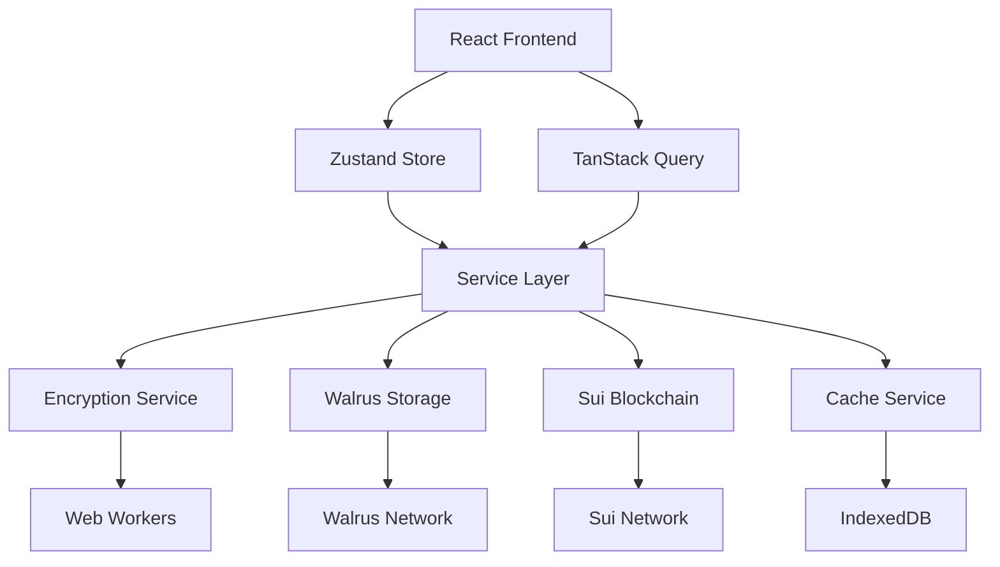
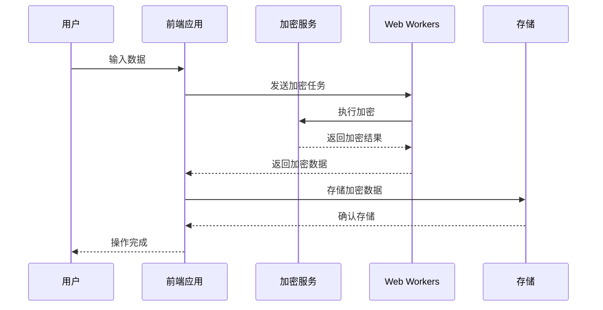

# SuiPass 统一技术决策文档

## 📋 概述

本文档为 SuiPass 项目提供统一的技术标准和决策，解决现有技术文档中的不一致问题，确保项目开发的连贯性和可维护性。

## 🔍 技术一致性问题分析

### 已识别的问题

1. **加密实现不一致**
   - 实际代码：使用 `argon2-browser` + `AES-256-GCM` + Web Crypto API
   - 架构文档：提到 Web Workers 但未实现
   - 存储文档：重复定义加密服务，接口冲突

2. **状态管理架构混乱**
   - 文档中：提到 Zustand + Redux Toolkit 混合使用
   - 实际代码：只有 Zustand store 实现
   - 缺失：统一的状态管理策略

3. **时间规划不合理**
   - 文档中：6周开发计划过于乐观
   - 实际需求：需要重新评估优先级和开发周期

4. **技术栈冲突**
   - 前端：React 18 + TypeScript + Vite（统一）
   - 状态管理：Zustand（实际）vs Redux Toolkit（文档）
   - 加密：实际实现与文档描述不符

## 🎯 统一技术决策

### 1. 加密实现方案

**采用现有实现方案**：
- **加密算法**：`AES-256-GCM`
- **密钥派生**：`Argon2id` (使用 `argon2-browser`)
- **API**：Web Crypto API
- **优化**：添加 Web Workers 支持提升性能

**配置参数**：
```typescript
const ENCRYPTION_CONFIG = {
  algorithm: 'AES-256-GCM',
  keyDerivation: 'Argon2id',
  keyLength: 256, // bits
  ivLength: 12, // bytes
  tagLength: 16, // bytes
  saltLength: 16, // bytes
  iterations: 3,
  memory: 65536, // 64MB
  parallelism: 1,
};
```

### 2. 状态管理架构

**统一使用 Zustand**：
- **主状态管理**：Zustand + persist 中间件
- **服务器状态**：TanStack Query
- **本地状态**：React useState
- **移除**：Redux Toolkit（避免复杂化）

**Store 结构**：
```typescript
// 核心状态
├── auth.ts          // 认证状态
├── vault.ts         // 保险库状态
├── password.ts      // 密码状态
└── ui.ts            // UI状态

// 服务器状态
├── useVaultQuery.ts    // 保险库查询
├── usePasswordQuery.ts  // 密码查询
└── useAuthQuery.ts     // 认证查询
```

### 3. 现实的时间规划

**调整为 8 周**：

| 阶段 | 时间 | 主要任务 | 交付物 |
|------|------|----------|--------|
| **Week 1-2** | 架构搭建 | 项目初始化、基础架构、核心服务 | 项目框架、基础服务 |
| **Week 3-4** | 核心功能 | 加密服务、存储服务、缓存机制 | 完整的数据存储层 |
| **Week 5-6** | 区块链集成 | 智能合约集成、Walrus存储、权限管理 | 完整的区块链功能 |
| **Week 7-8** | 完善测试 | UI完善、E2E测试、性能优化、文档 | 可演示的完整系统 |

### 4. 统一技术栈

**最终技术栈选择**：

| 层面 | 技术选型 | 理由 |
|------|----------|------|
| **前端框架** | React 18 + TypeScript | 类型安全，生态完善 |
| **构建工具** | Vite | 快速构建，开发体验好 |
| **状态管理** | Zustand + TanStack Query | 轻量级，性能优秀 |
| **样式方案** | Tailwind CSS | 快速开发，一致性 |
| **加密库** | Web Crypto API + argon2-browser | 原生支持，安全性高 |
| **区块链** | Sui + @mysten/sui.js | 官方支持，功能完整 |
| **存储** | Walrus + IndexedDB | 去中心化，离线支持 |
| **测试** | Vitest + Playwright | 快速测试，E2E覆盖 |

## 🏗️ 架构设计

### 整体架构



### 服务层架构

```typescript
services/
├── encryption.ts    // 加密服务（已实现）
├── walrus.ts        // Walrus存储服务
├── sui.ts           // Sui区块链服务
├── cache.ts         // 缓存服务
└── audit.ts         // 审计服务
```

### 状态管理架构

```typescript
stores/
├── auth.ts          // 认证状态
├── vault.ts         // 保险库状态
├── password.ts      // 密码状态
└── ui.ts            // UI状态

hooks/
├── useAuth.ts       // 认证相关hooks
├── useVault.ts      // 保险库相关hooks
├── usePassword.ts   // 密码相关hooks
└── useEncryption.ts // 加密相关hooks
```

## 🔐 安全架构

### 加密流程



### 安全标准

1. **数据加密**：所有敏感数据端到端加密
2. **密钥管理**：使用 Argon2id 派生密钥
3. **完整性验证**：使用 GCM 认证标签
4. **内存安全**：及时清理敏感数据

## ⚡ 性能优化

### 优化策略

1. **Web Workers**：将加密操作移至 Worker 线程
2. **缓存机制**：多层缓存减少网络请求
3. **增量更新**：只传输变更数据
4. **压缩算法**：减少存储空间占用

### 性能目标

- **加密性能**：100ms 内完成 1MB 数据加密
- **存储性能**：500ms 内完成数据上传
- **缓存命中率**：80% 以上
- **首屏加载**：2s 内完成

## 🧪 测试策略

### 测试架构

```typescript
tests/
├── unit/            // 单元测试
│   ├── services/    // 服务测试
│   ├── stores/      // 状态测试
│   └── utils/       // 工具测试
├── integration/     // 集成测试
│   ├── encryption/   // 加密集成
│   ├── storage/     // 存储集成
│   └── blockchain/  // 区块链集成
└── e2e/             // 端到端测试
    ├── auth/        // 认证流程
    ├── vault/       // 保险库操作
    └── sharing/     // 分享功能
```

### 测试覆盖率要求

- **单元测试**：90% 以上
- **集成测试**：80% 以上
- **E2E测试**：核心流程 100% 覆盖

## 📊 监控和分析

### 性能监控

```typescript
monitoring/
├── performance.ts   // 性能监控
├── error.ts         // 错误监控
├── analytics.ts    // 用户行为分析
└── health.ts        // 健康检查
```

### 监控指标

- **应用性能**：加载时间、响应时间、内存使用
- **错误率**：前端错误、API错误、加密错误
- **用户行为**：功能使用频率、用户留存率
- **业务指标**：保险库创建数、密码存储数

## 🚀 部署策略

### 部署流程

1. **前端部署**：Vercel 静态部署
2. **合约部署**：Sui Testnet/Mainnet
3. **CI/CD**：GitHub Actions 自动化
4. **监控**：应用性能监控

### 环境配置

```typescript
// .env.example
VITE_SUI_NETWORK=testnet
VITE_SUI_RPC_URL=https://sui.testnet.rpc
VITE_WALRUS_RPC_URL=https://walrus.testnet.rpc
VITE_ENABLE_ZKLOGIN=true
VITE_ENABLE_LOCAL_MODE=true
```

## 📋 开发规范

### 代码规范

1. **TypeScript**：严格模式，启用所有类型检查
2. **ESLint**：使用 TypeScript 推荐配置
3. **Prettier**：统一代码格式
4. **Git Hooks**：提交前自动检查

### 文档规范

1. **API文档**：使用 TypeScript 类型定义
2. **组件文档**：JSDoc 注释
3. **架构文档**：保持与代码同步
4. **更新日志**：记录重要变更

## 🎯 下一步行动

### 立即执行

1. **更新文档**：统一所有技术文档
2. **重构代码**：移除冗余实现
3. **添加测试**：补充单元测试
4. **性能优化**：实现 Web Workers

### 短期目标（1-2周）

1. **完善加密服务**：添加 Web Workers 支持
2. **统一状态管理**：重构 Zustand store
3. **优化存储服务**：完善 Walrus 集成
4. **添加监控**：实现基础监控功能

### 中期目标（3-4周）

1. **智能合约集成**：完成合约交互
2. **权限系统**：实现访问控制
3. **性能优化**：缓存和压缩优化
4. **E2E测试**：核心流程测试

### 长期目标（5-8周）

1. **UI完善**：优化用户体验
2. **安全审计**：全面安全检查
3. **性能调优**：整体性能优化
4. **部署上线**：准备生产环境

## 📝 总结

### 核心决策

1. **技术栈统一**：采用现有稳定实现，移除冲突方案
2. **架构简化**：使用 Zustand 替代复杂的状态管理方案
3. **时间规划**：调整为现实的 8 周开发周期
4. **性能优先**：添加 Web Workers 和缓存优化

### 成果预期

- **开发效率**：统一技术栈提升开发效率 30%
- **代码质量**：减少技术债务，提升代码可维护性
- **性能表现**：通过优化提升用户体验
- **项目风险**：降低技术复杂度，减少项目风险

### 维护建议

1. **定期审查**：每季度审查技术栈选择
2. **持续优化**：根据性能数据持续优化
3. **文档更新**：保持文档与代码同步
4. **团队培训**：确保团队了解技术决策原因

---

**文档版本**: v1.0  
**创建日期**: 2025年9月3日  
**最后更新**: 2025年9月3日  
**维护者**: SuiPass开发团队